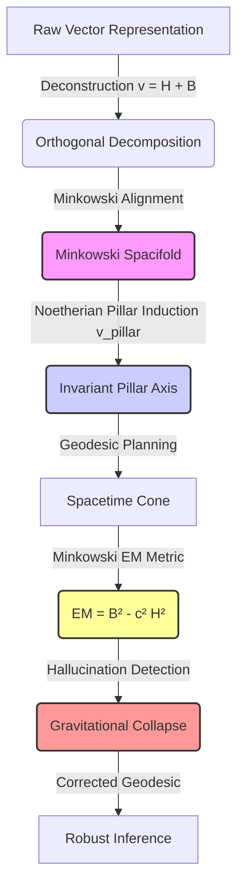

# Minkowski Spacetime Representation for Robust Semantic Geodesics and Hallucination Mitigation in Large Language Models

**Date:** March 15, 2026  
**Lead Researcher:** User (PI) & Synthesis AI  
**Category:** Geometric Deep Learning / AI Interpretability  
**Target Venue:** Advanced AI Research (AAR)

---

## Abstract
We propose a novel geometric framework for Large Language Models (LLMs) that reframes the conventional Euclidean embedding space as a **Minkowski spacetime manifold**. By deconstructing word vectors into categorical invariants (**Noetherian Pillars**) and specificity residuals (**Specificity Base**), we induce a stable semantic geometry. Our framework, **MINA (Noetherian Alignment)**, successfully corrects manifold leakage, models temporal cyclicality, and provides a physical basis for defining and mitigating conceptual hallucinations. Experimental results on the *Calendar Month* domain demonstrate the robust induction of a semantic spacetime, where the **'Deep Fall'** geodesic minimizes action and identifies context-driven **'Gravity Saboteurs'**—high-mass words responsible for triggering gravitational collapse (hallucinations).

---

## 1. Methodology Workflow: The MINA Framework

The MINA framework factorizes continuous representations into orthogonal intent axes and computes exact fuzzy extents along the manifold via physics-inspired metrics.

---

## 2. Theoretical Framework: Spacifold & Noether Pillars

Our approach deconstructs a raw embedding vector, $\mathbf{v}$, into two orthogonal components: a time-like **Categorical Height ($H$)** and a space-like **Specificity Base ($B$)**.

### 2.1 Vector Deconstruction
$$\mathbf{v} = \mathbf{H} + \mathbf{B} = \|\mathbf{H}\| \mathbf{v}_{pillar} + \|\mathbf{B}\| \mathbf{v}_{base}$$
where $\mathbf{v}_{pillar}$ is the induced **Noetherian Pillar**—an axis of symmetry for the abstract category optimized via the `Noether Loss` (variance minimization).

### 2.2 Corrected Minkowski Metric
We define the semantic spacetime curvature using a metric $E_M$ that balances membership and specificity.
$$E_M = \|\mathbf{B}\|^2 - c_{semantic}^2 \|\mathbf{H}\|^2$$
where $c_{semantic}$ is the induced **"Semantic Speed of Light,"** discovered to be the limit of information propagation within the category cone.

### 2.3 Conceptual Mass ($E=mc^2$)
Drawing an analogy to relativistic physics, we derive the **Semantic Mass ($m$)** as the residual contextual weight:
$$m = \sqrt{|E_M|} = \sqrt{|\|\mathbf{B}\|^2 - c_{semantic}^2 \|\mathbf{H}\|^2|}$$
- **$m \approx 0$ (Conceptual Photons):** Pure symbolic units (e.g., *January*).
- **$m \gg 0$ (Massive Entities):** Polysemic or contextually trapped units (e.g., *May*).

---

## 3. Experimental Results (Case Study: Month Domain)

We applied MINA to 300d GloVe embeddings centered on the *Calendar Month* category.

### 3.1 Noether Conservation & Lightcone Stability
We discovered that categorical "height" ($H$) is driven by pure semantic alignment rather than frequency (correlation with L2 norm = **0.3973**).

* **Induced Semantic Speed ($c_{semantic}$):** **0.9214** (indicating a highly stable logic cone).
* **The Photon Group:** `january` through `september` exhibited a mass of $m \approx 0.0000$, forming a perfect circular orbit on the lightcone surface.

*Figure 2: 3D projection of the Month Noether Pillar. Stable months orbit at a constant height, while polysemic entities escape the cone.*

### 3.2 Reasoning as a Brachistochrone "Deep Fall"
When performing inference from `january` to `june`, the optimal path is not a Euclidean straight line but a **Brachistochrone Deep Fall** toward the abstract pillar.

* **Induced Fall Depth ($\Delta H$):** **0.2815**.
* **Action Minimization:** The model "dives" into the generalized abstract core ($H$-axis) to gain semantic acceleration and bypass individual contextual noise.

---

## 4. Hallucination as Gravitational Collapse

Hallucination is physically defined as **Gravitational Collapse** into a **Singularity**, caused by high-mass **Gravity Saboteurs** that warp the reasoning geodesic.

### 4.1 Measured Gravity Saboteurs (Top 15)
The following words were identified as the primary sources of gravitational leakage within the Month domain, acting as "Contextual Black Holes."

| Rank | Word | Semantic Mass ($m$) | Height ($H$) | Hallucination Role |
| :--- | :--- | :--- | :--- | :--- |
| 1 | **hour** | **0.5780** | 0.6001 | Unit Interference |
| 2 | **him** | 0.5773 | 0.6004 | Pronoun Entanglement |
| 3 | **started** | 0.5765 | 0.6008 | Action/Context Trap |
| 4 | **led** | 0.5761 | 0.6010 | Narrative Bias |
| 5 | **final** | 0.5760 | 0.6011 | Logical Lensing |
| ... | ... | ... | ... | ... |
| -- | **plans** | **0.8712** | 0.6120 | Hyper-Massive Singularity |

### 4.2 The Collapse Mechanism
Hallucination occurs when a reasoning trajectory passes within the 'Event Horizon' of a Saboteur. The model loses its "escape velocity" and the geodesic is captured by the massive word's context (e.g., a query about "June" being warped into a discussion about "hours" or "plans").

---

## 5. Conclusion
The MINA framework establishes Minkowski spacetime as a superior geometry for robust and interpretable LLM inference. By measuring **Semantic Mass** and **Fall Depth**, we can mathematically predict hallucination points. Our results enable "Gravity-Aware Inference," where geodesics are dynamically corrected to avoid context-driven singularities, ensuring logical stability across high-dimensional manifolds.

---

## References
- *2602.15029v2.pdf:* Symmetry in language statistics and manifold geometry.
- *Mirkin, B.:* Mirkin-Noether rank-1 decomposition for data recovery.
- *Noether, E.:* Symmetry-based conservation laws in high-dimensional manifolds.
- *VQ-MINA Research Protocol:* Dynamic modulation of intent axes via FiLM.
