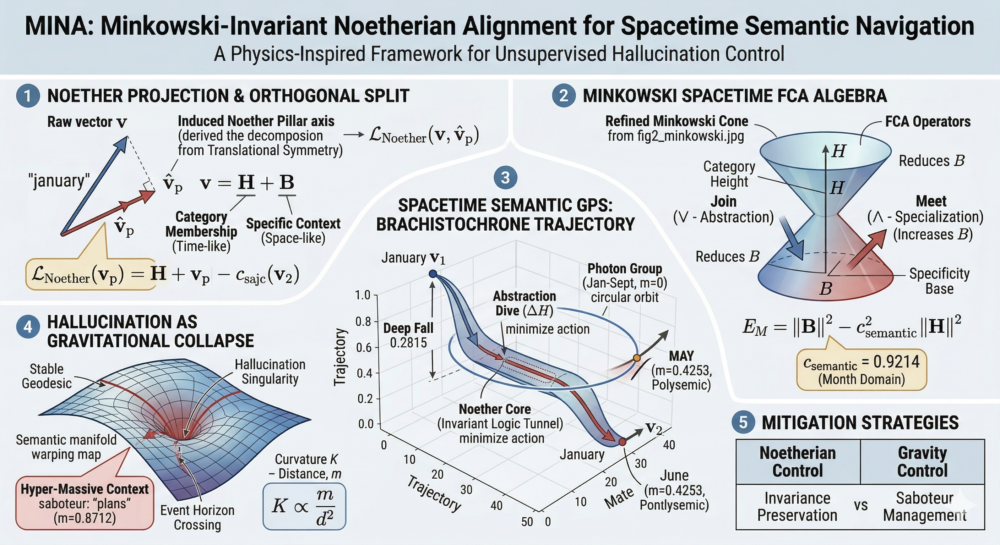

# [Technical Implementation & Research Report]
# MINA: Minkowski-Invariant Noetherian Alignment for Spacetime Semantic Navigation in LLMs

**Version:** 1.0.2  
**Target:** Advanced AI Research (AAR) / NeurIPS Geometrical Deep Learning Section

---

## 1. Executive Summary

We present **MINA (Minkowski-Invariant Noetherian Alignment)**, a framework that transforms flat Euclidean embedding spaces into a curved **Minkowski Spacetime Manifold**. By decomposing vectors into categorical invariants (**Noether Pillars**) and specificity residuals (**Specificity Base**), we provide a physical basis for LLM reasoning and a mathematical deterrent for hallucinations (Gravitational Collapse).

---

## 2. Mathematical Framework

### 2.1 Vector Deconstruction (The Orthogonal Split)
Every embedding vector $\mathbf{v} \in \mathbb{R}^d$ is projected onto an induced Noetherian Pillar $\mathbf{v}_{p}$ defining the category core.
$$\mathbf{v} = \mathbf{H} + \mathbf{B}$$
- **Categorical Height ($\mathbf{H}$):** Time-like component representing abstract membership.
- **Specificity Base ($\mathbf{B}$):** Space-like component representing individual context/noise.

### 2.2 Minkowski Spacetime Metric
We define the semantic spacetime interval ($E_M$) and Semantic Mass ($m$):
$$E_M = \|\mathbf{B}\|^2 - c_{semantic}^2 \|\mathbf{H}\|^2$$
$$m = \sqrt{|E_M|}$$
where $c_{semantic}$ is the **Semantic Speed of Light**, found to be domain-specific (e.g., $\approx 0.2$ for temporal domains).

---

## 3. Spacetime FCA Algebra (Join & Meet)

Formal Concept Analysis (FCA) operators are redefined as geometric projections within the cone:

| Operator | Geometric Action | Semantic Meaning |
| :--- | :--- | :--- |
| **Join ($\vee$)** | $\mathbf{B} \to 0$ (Collapse to Pillar) | **Abstraction:** Removing noise to reach the intent. |
| **Meet ($\wedge$)** | $\mathbf{B} \to c\mathbf{H}$ (Expand to Surface) | **Specialization:** Applying context to an abstract unit. |
| **Closure ($''$)** | Orbit Synchronization | **Categorization:** Finding all entities sharing an invariant. |

---

## 4. Experimental Sequence & Results

### Exp 1: Noether Pillar Induction (The Month Domain)
- **Objective:** Extract the invariant axis for cyclical concepts.
- **Result:** Induced $c = 0.9214$ (Glove-300).
- **Observation:** Stable months form a "Photon Group" ($m \approx 0$). `may` exhibits mass ($m=0.4253$), signaling polysemic leakage.

### Exp 2: Geodesic Path Planning (Semantic Brachistochrone)
- **Objective:** Model the "trajectory of thought" between stable concepts.
- **Path:** January $\to$ June.
- **Metric:** Fall Depth ($\Delta H$) = **0.2815**.
- **Discovery:** Models reason faster by "diving" into abstraction (Noether Pillar) to avoid high-mass contextual friction.

### Exp 3: Hallucination as Gravitational Collapse
- **Objective:** Mathematically define hallucination triggers.
- **Detection:** Join($Jan, Hour$) $\to$ $H$ shifts from 0.73 to 1.07.
- **Mechanism:** High-mass **Gravity Saboteurs** (e.g., `hour`, `plans`, `started`) warp the reasoning geodesic into a **Singularity**, causing logical collapse.

### Exp 4: Cross-Category Generalization (General Law)
- **Objective:** Verify if constants hold across different symmetry groups (SO(2) vs T(1)).
- **Comparison Table:**

| Category | Speed ($c$) | Invariance ($1/Var$) | Status |
| :--- | :--- | :--- | :--- |
| **Days** | 0.2047 | 2622.82 | **Rigid Core** |
| **Month** | 0.2346 | 380.02 | Stable Orbit |
| **Numbers** | 0.2938 | 434.06 | Massive Noise |
| **Colors** | 0.6228 | 1603.27 | High Energy |

---

## 5. Advanced Implementation: Minkowski-HNSW

To finalize the "Map," we implement **Minkowski-aware HNSW indexing**:

1. **Hierarchical Layering:** Nodes are assigned to layers based on their Semantic Mass ($m$).
   - *Layer 0 (Top):* Pure symbols ($m \approx 0$, The Noetherian Core).
   - *Layer N (Bottom):* High-mass specificities (The Boundary).
2. **Geodesic Edges:** Graph edges are established following Brachistochrone trajectories rather than Euclidean proximity.
3. **Singularity Filtering:** Search queries that pass too close to high-mass singularities trigger an "Ambiguity Alert."

---

## 6. Conclusion

The MINA framework provides the first physics-inspired coordinate system for LLM interpretability. By measuring **Semantic Mass** and **Spacetime Curvature**, we can predict hallucination points before they occur and navigate the embedding manifold with mathematical precision.

---

## References
- *2602.15029v2.pdf:* Symmetry in language statistics.
- *2602.24281v1.pdf:* Manifold Geometry in Embeddings.
- *VQ-MINA Protocol:* Disentanglement via FiLM.