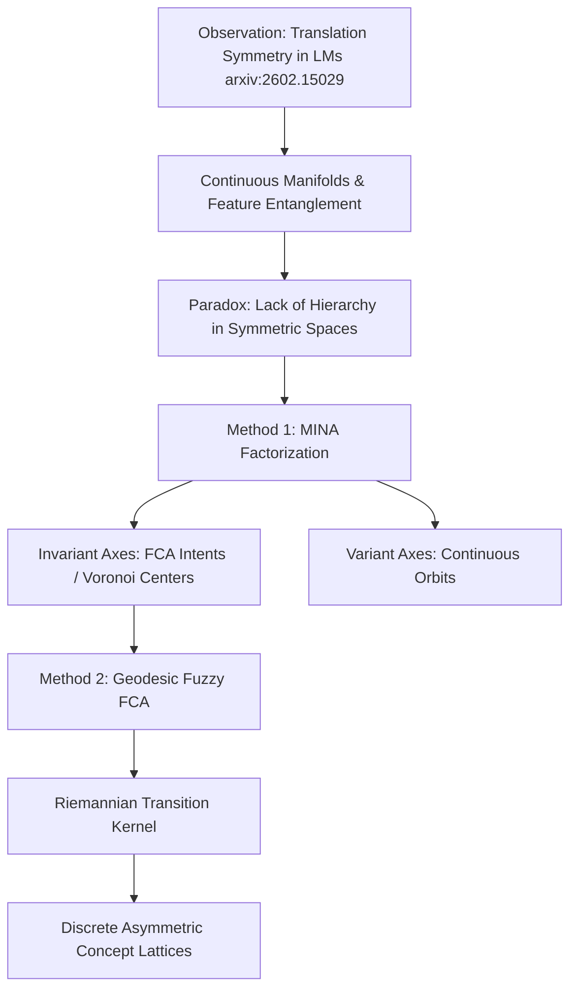

# Symmetry to Structure: Disentangling Riemannian Lattices in Language Models

## Paper Structure Overview

## 1. Introduction
Recent findings from arxiv:2602.15029 mathematically demonstrate that translation symmetry in word co-occurrence statistics spontaneously induces continuous geometric structures, such as circles, loops, and manifolds, within language model embeddings. While these symmetric manifolds excel at capturing the smooth, continuous flow of context, they introduce a fundamental paradox for logical reasoning. A perfectly symmetric, continuous space fundamentally lacks asymmetry and hierarchy, which are the prerequisites for logic. Consequently, performing discrete algebraic operations, such as element-wise $$ \min $$ or $$ \max $$, directly on the original embedding space results in geometric noise rather than meaningful hierarchical traversal. 
This paper embraces the existence of these symmetric manifolds but proposes a novel framework combining "MINA" (Mirkin Invariant Noether Axes) and Formal Concept Analysis (FCA) on Riemannian manifolds. Our framework maps continuous, entangled symmetries into discrete, asymmetric concept lattices, enabling neural networks to perform rigorous logical reasoning.

## 2. Background: The Entanglement of Symmetric Spaces
As proven by the aforementioned baseline study, translation symmetry forces representations into continuous orbits. In such spaces, variant information (e.g., tense, position, syntactic shifts) and invariant semantic hierarchy (e.g., "dog" -> "animal") are heavily entangled within a single dense tensor.
This Euclidean entanglement strictly prohibits the direct application of classical "FCA". In a curved space, linear interpolations (Euclidean distances) cross through meaningless "dead spaces" rather than following the valid semantic trajectory. Therefore, one cannot establish rigid properties (Intents) out of a continuous potential energy landscape without first factorizing the space and redefining the distance metric.

## 3. Method 1: Mirkin-Noether Factorization (MINA)
To erect a discrete lattice upon a continuous manifold, we introduce MINA, a projection bottleneck inspired by Noether's theorem. This module orthogonalizes the entangled manifold into two distinct subspaces:
- Variant Axes ($$V$$): Parameterize the continuous motion along the symmetry orbits.
- Invariant Axes ($$I$$): Capture the conserved quantities that remain stable across symmetry transformations.

The invariant axes serve as the rigid conceptual skeleton. We define the Voronoi cell centers strictly within this invariant subspace, forcing them to act as the exact "Intents" for FCA. The factorization is enforced via the following objective functions:

$$[L_{inv} = \mathbb{E}_{x,g} \left[ || u_I(x) - u_I(g(x)) ||^2 \right]]$$

\[
L_{var} = \mathbb{E}_{x,g} \left[ || u_V(g(x)) - G_V u_V(x) ||^2 \right]
\]

where $$ g $$ represents a translation transformation, $$ u_I $$ and $$ u_V $$ are the projected invariant and variant coordinates, and $$ G_V $$ is the linear operator approximating the group action in the variant space. By explicitly minimizing the covariance between axes (Decorrelation), MINA ensures that the extracted invariant axes are geometrically orthogonal and semantically independent.

## 4. Method 2: Geodesic Fuzzy FCA on Riemannian Manifolds
Because the underlying embedding space is a Riemannian manifold with global curvature, classical fuzzy logic based on Euclidean distance fails to measure the true membership between a word and an FCA Intent. To bridge this gap, we propose Geodesic Fuzzy Mapping.
Instead of using a binary $$ 1/0 $$ threshold or Euclidean cosine similarity, the probability that a concept belongs to a specific Voronoi cell (Intent) is modeled as a least-action transition probability along the manifold's surface. We define the transition kernel $$ P_{ij} $$ as:

$$[P_{ij} = \frac{\exp(-d_M(h_i, h_j) / \tau)}{\sum_k \exp(-d_M(h_i, h_k) / \tau)}]$$

where $$ d_M(h_i, h_j) $$ is the geodesic distance on the manifold $$ M $$, $$ h_i $$ is the current state, $$ h_j $$ is the target Voronoi center, and $$ \tau $$ is the temperature parameter.
This Boltzmann-normalized kernel transforms geodesic distances into soft, fuzzy membership scores. It allows the model to treat local variations within a cell as linear, while respecting the non-linear, global curvature required to perform a valid $$ \min $$ (Join) jump to a parent concept cell.

## 5. Conclusion
This research provides the missing link between symmetry-induced continuous manifolds and asymmetric logical structures. By factorizing axes via MINA and applying geodesic transition kernels to establish a soft FCA lattice, our framework completely bypasses the geometric noise of symmetric spaces. This enables embedding models to reliably execute discrete logical leaps, paving the way for inherently interpretable and logically sound neural reasoning.
